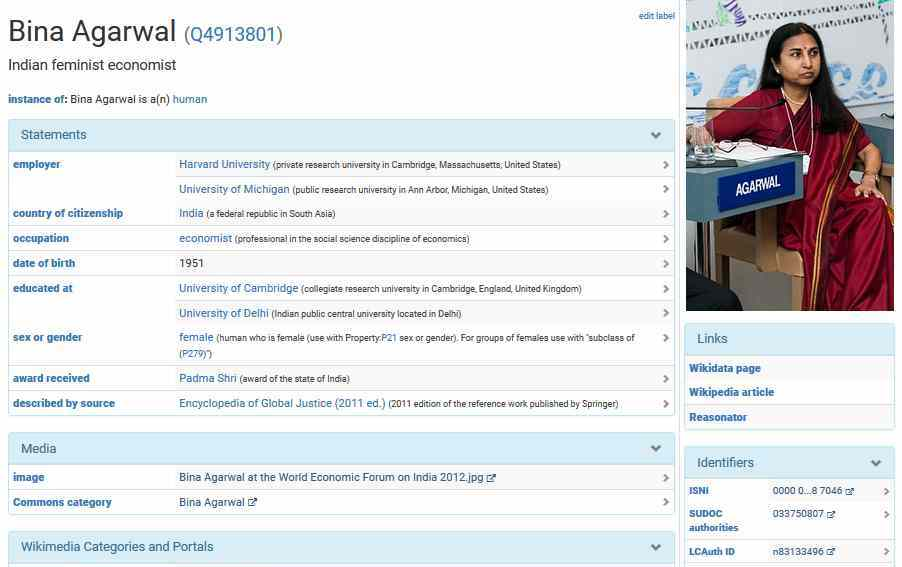

# Wikidata (für Archive)

#### AK Archive der Leibniz-Gemeinschaft Bonn, 1.10.2019

[Joachim Neubert](http://zbw.eu/labs/en/user/joachim-neubert)

<!--
ZBW - Leibniz-Informationszentrum Wirtschaft, Kiel/Hamburg
ZBW - Leibniz Information Centre for Economics, Kiel/Hamburg (Germany)
-->

 

<small>https://jneubert.github.io/slides/wd-ak-archive-2019/ 
</small>

Note: Wer hat schon
- von Wikidata gehört?
- Abfragen an Wikidata formuliert?
- zu Wikidata beigetragen?

---

## Agenda

1. Was ist und wie funktioniert Wikidata?
2. Wie können Archive
  - es nutzen?
  - sich verlinken?
  - beitragen?

<!--
3. Wie sichert Wikidata die Qualität?
-->

---

## Wikidata ist ...

... eine freie, kollaborative und vielsprachige Wissensdatenbank.

- Daten für alle Zwecke frei verfügbar (CC0-Lizenz)
- jede/r kann ändern (wie in Wikipedia)
- Inhalte für alle Sprachen verfügbar

Note: Aus Wikipedia entstanden
- Information an einer Stelle
- Verknüpfung Sprachversionen

explizit auch für andere Nutzungen

---

## Strukturierte Daten

Note: Wikidata besteht im wesentlichen aus
- Items
  - eindeutig identifiziert durch Qids
  - mit einem Label pro Sprache
- Statements mit
  - Property
    - eindeutig identifiziert durch Pids
    - ebenfalls ein Label pro Sprache
  - Wert (String, Datum, Item, etc)
    - optional Qualifier und Referenzen

---

### Beispiel-Item

Note: Englische / deutsche Fassung (Link)
- nicht nur Text zu dem Item selbst, sondern auch die Bezeichnungen verlinkter Items und der Properties folgen der bevorzugten Sprache
- Referenzen
- Items nicht nur zu Personen, sondern auch zu Orten, Organisationen, Werken, abstrakten Konzepten ...

---

## Nutzung - Schnittstellen

- [Website](https://www.wikidata.org) / Wikipedia verlinkt auf Items
- Abfragen über http://query.wikidata.org/ (SPARQL)
- Gesamt-Datendumps
- API (JSON)
- Applikationen auf Grundlage der API

---

### Verlinkung zu externen Daten - Beispiel

Note: Sektion Identifier / Bezeichner
- Link zu RePEc - direkter Zugriff auf Working Papers der Autorin

---

## Verlinkungs-Mechanismus

- ca. 4000 Properies vom Datentyp "external-id"
- große Vielfalt, z.B.:
  - GND / VIAF / Geonames IDs
  - Proteine
  - afrikanische Pflanzen
  - schwedische Kulturerbe-Objekte
- funktionsfähige Links (in Verbindung mit einem URL-Template)
- die Einrichtung von neuen Properties kann jede/r beantragen [(Beispiel)](https://www.wikidata.org/wiki/Wikidata:Property_proposal/STW_Thesaurus_for_Economics_ID)
- Toolunterstützung, insbesondere [Mix-n-Match](https://tools.wmflabs.org/mix-n-match/)

---

## Wie können Archive beitragen?

- Links zu ihren Beständen
- fehlende Werte für Properties ergänzen (mit Tools wie [QuickStatements](https://tools.wmflabs.org/quickstatements/))
- fehlende Items ergänzen (dito)

---

### z.B. Pressemappe 20. Jahrhundert

- alle 5.266 Personenmappen verlinkt (346 neue Items)
- zusätzliche Daten (z.B. Berufsangaben für Wirtschaftswissenschaftler/innen)
- zusätzliche Verknüpfungen (z.B. Famile Warburg)
- in Abfragen und Anwendungen nutzbar
  - z.B. Karte von Wirtschaftswissenschaftler/innen der Pressemappe per [Wikidata-Abfrage](https://w.wiki/3uX)

Note: Vorbereitung einer Data Donation an Wikidata
- konkret die Metadaten
- ZBW bleibt in der Verantwortung (Wikidata als sekundäre Datenbank)

---

## Agieren in der Wikidata-Community

- Beteilung mit individuellem User (tunlichst unter Offenlegung der beruflichen Einbindung - [Beispiel](https://www.wikidata.org/wiki/User:Jneubert))
- keine zentrale Entscheidungsstruktur
- Konsensbildung, mit dem [Project Chat](https://www.wikidata.org/wiki/Wikidata:Project_chat) als wichtigstem Forum
- WikiProjects, um Themen zu fokussieren (oft auch gute Anlaufstelle für Datenstrukturierung)

---

### z.B.

---

## Wikidata für Archive

- erhöhte Sichtbarkeit (zusätzlicher Discovery-Kanal)
- Kontextualisierung für die eigenen Bestände, ohne die Daten selbst erheben/speichern zu müssen
- Crowdsourcing für eine erweiterte Erschließung?
- Einstieg in Linked Open Data

---

## Vielen Dank - Fragen willkommen!

[Joachim Neubert](http://zbw.eu/labs/en/user/joachim-neubert) 
j.neubert@zbw.eu 
auf Wikidata: [Jneubert](https://www.wikidata.org/wiki/User:Jneubert) 

---

# _zusätzliches Material_

---

